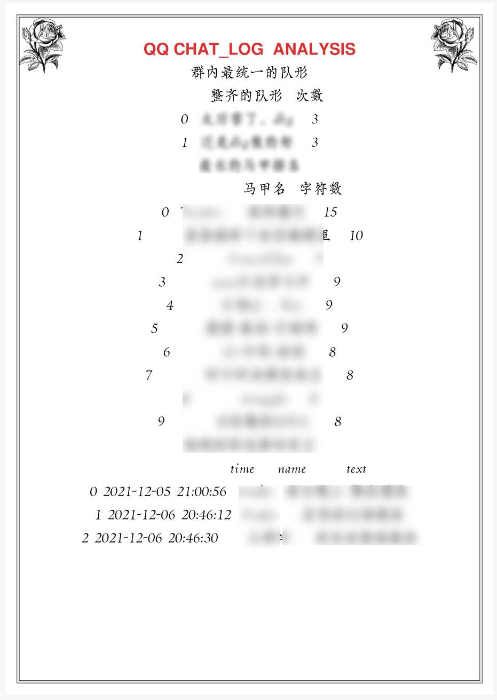
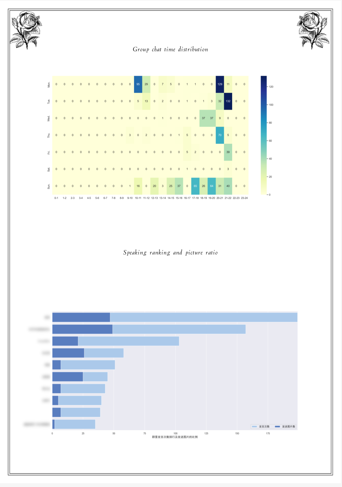

# 项目流程介绍  
## 1.明确分析目标 
通过对 QQ 群内消息分析，帮助群内成员及管理成员回顾聊天内容，以及实现对应有 助与管理员管理群聊的实用功能。 
## 2.理解数据 
### 获取数据
通过 QQ/TIM 等自带的消息管理管理器将对应的群聊天消息导出为 txt 文件，同时需要注意的是默认导出形式为 UTF8 +BOM 格式，由于兼容性，带 BOM 的 utf-8 
在一些 browser 中显示为乱码。先需要将编码格式转换为 UTF8 格式。 
 
在 class ReadChatlog 
通过正则匹配将纯文本信息存入 mongoDB，数据库 chatlog，生成表 vczh
### 构建用户画像
由 vczh 表将信息提取至数据库 chatlog 的 profile 表，便于后续处理 
## 3.数据预处理
### 数据清洗 （无关数据，重复数据、平滑噪声，处理异常与缺失）
由于等级标签有极大部分缺失，所以直接去除，在数据写入过程中过滤群头衔、
群等级相关的无关信息。
### 数据集成
基于原始的聊完数据，构建出每个用户的禁言时间、周活跃分布等属性。
## 4.分析建模
导入 jieba 包对用户发言进行分词处理，生成 word 表 
将分词后的词名与频率提取出可以生成对应的群内词频最高词汇组成的词云 
同时可以指定对应的关键词，生成对应的话题词云，直观反映群内成员对该话题关键词热度。
### 情感检测
其原理为分词以及去停用词的操作，读取正样本与负样本调用贝叶斯模型，项
目中通过导入 snownlp 包实现。 
生成对应活跃成员情感指数变化折线图，也可指定群成员分析其对应的情感变
化，帮助群内管理员了解其群聊内部成员心理状态变化。
### 违禁词汇检测
可以检测群内成员发言的是否包含违禁词，快速过滤出其发言者 ID、言论、及
发言时间，帮助群内管理员及时发现其不良现象，维护群内聊天氛围；同时也可加入其它指定词汇方便管理员了解其它群内状态，比如导入包含自杀倾向的词库，结合其情感检测便于群管理员快速对过滤出的成员进行干预疏导。
### 聊天主题提取
此功能通过关键词提取算法 TF/IDF 算法实现。 
TF-IDF(Term Frequency-Inverse Document Frequency)，词频-逆文档频次算法，常用于评估在一个文档集中一个词对某份文档的重要程度。一个词对文档越重要，那就越可能是文档的关键词。 
TF 统计一个词在一篇文档中出现的频次，基本思想是一个词在文档中出现次数越多，则其对文档的表达能力也就越强。 
IDF 统计一个词在文档集的多少个文档中出现，基本思想是如果一个词在越少的文档中出现，则其对文档的区分能力也就越强。 
tf(word) = (word 在文档中出现的次数)/(文档总词数) 
idf = log(|D| / (1+|Di|)) 。|D|为文档集中总文档数，|Di|为文档集中出现词 i 的文档
数量。 
TextRank 算法 
TextRand 算法的一个重要特点是可以脱离语料库的背景，仅对单篇文档进行分析就
可以提取该文档的关键词。最早用于文档的自动摘要，基于句子维度的分析，对于
每个句子进行打分，挑选出分数最高的 n 个句子作为文档的关键句，以达到自动摘
要的效果。 
同时通过导入 gensim 包，实现上述模型，得出关键词列表。 
通过聊天主题的提取，方便群管理员及成员快速了解其聊天群内热门聊天话题，便
于成员回顾总结历史群聊天记录，同时如果是专业性质的聊天群，管理与也可借助
此功能判断群内成员聊天是否脱离原主题，以此为预警。
### 可视化及分析结果展示
根据上述模型及数据处理实现功能模块列表所述功能，将分析结论写入 out.txt 保存，以及所得关键数据进行可视化。同时考虑到用户体验，实现将所生成图片及结论自动布局生成 pdf，用户以此获得数据分析结果。
# 关键功能
1.1 查看群内高谈阔论时刻
1.2 找出群内长篇大论
1.3 找出小黑屋常客
1.4 找出群内水群怪（返回列表，标准由发送图片数量/个体总发言量+个体总发言/群总发言数）
2.1 聊天主题提取
2.2 情感分析
本项目文本情感分析主要采用 Bayes 模型对聊天发言的情感好坏与否进行分类。通过分词与第二步去去掉分词中的停顿词，即中文中的：的、地、得类似的无法表示表述有效情感信息的停顿词，然后再放入模型训练，以及使用训练好的模型进行预测分类。
# 结果展示

# 相关问题
## 分析数据呈现问题  
* 应该选择Pyecharts呈现而不是导出pdf文档（优点图表美观现代化，生成网页可交互，用户体验更好，而且可以网页转pdf😅）  
* 选择pdf库的问题  
 * 由于python关于pdf的第三方库多，没有在选择库的使用下功夫，只是简单选择了FPDF（操作简单）  
 * 对应缺点：  
 * 年久失修  
 * 性能不佳，生成pdf的时间久  
 * 不方便模板化  
## pymongo版本    
4.0之后版本对insert方法进行了更改    
退回版本或者（insert_one()、insert_many（））  
## 敏感词检测    
可以用DFA过滤敏感词算法，没有做性能上的优化  
## 词频统计   
可以根据内置方法得出词频，效率比直接Counter计算更高
